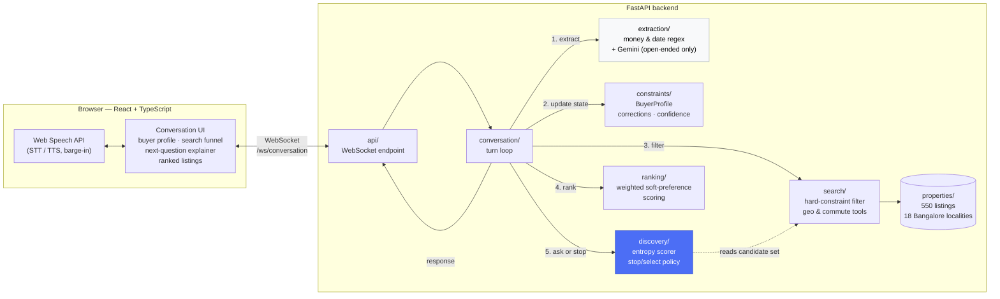
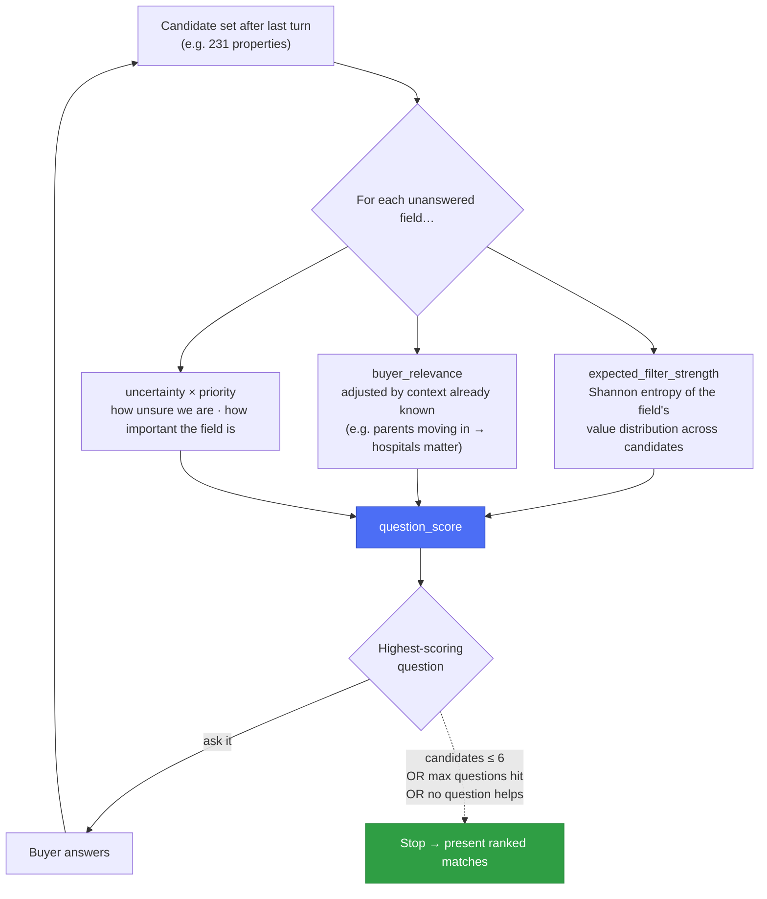

<div align="center">

# 🏠 Basera

### Voice-first real-estate search that asks the *right* next question — not the next question on a form

[](backend)
[](frontend)
[](backend/tests)
[](backend)
[](backend/app/api)

**[Demo flow](#-demo-flow) · [Why this is hard](#-why-this-is-a-hard-problem) · [Architecture](#-architecture) · [How discovery works](#-how-progressive-discovery-works) · [Running it](#-running-it)**

</div>

---

Real-estate search UIs make you fill out a form before they'll help you: city,
budget, bedrooms, locality, possession date — eight fields, in a fixed order,
before a single result appears. Half of them don't matter for your search;
the one that matters most is buried at the bottom.

**Basera throws out the form.** A buyer talks, in any order, with
corrections and hesitation and half-finished thoughts, the way people
actually describe what they want. After every utterance the backend
re-evaluates the *entire remaining candidate set* and asks — out loud —
whichever still-unknown question would cut that set down the most. It stops
asking as soon as a handful of strong matches remain, and it can explain
*why* it asked what it asked.

## 🎙 Demo flow

```text
Buyer   "I want a 3BHK in Bangalore around two crore."
Basera  → extracts city=Bangalore, bedrooms=3, budget≈₹1.8–2.2Cr
         → 231 of 550 properties still match
         → picks "locality" as the next question (~99% expected narrowing)

Buyer   "My wife's office is in Koramangala, but my parents will live with
         us, so being close to hospitals matters more than my commute."
Basera  → office_location=Koramangala        (context, not the buyer's locality)
         → parents_living_with_buyer=true
         → hospital_access=high, buyer_commute=low

Buyer   "Actually, I can stretch to 2.1 crore."
Basera  → budget revised: ₹2.0Cr (±10%) → ₹2.1Cr   [correction detected]

  … conversation continues until candidates ≤ 6, then:

Basera  "I've narrowed this down to 5 strong options. Let me walk you
         through the top matches …"   + ranked listings with match scores
```

## 🧩 Why this is a hard problem

| Naive approach | What breaks | What Basera does instead |
|---|---|---|
| Fixed questionnaire (budget → bedrooms → locality → …) | Asks questions that are already irrelevant given earlier answers; ignores what the buyer actually cares about | Re-scores **every** unanswered field after every turn and asks the one with the highest expected narrowing |
| LLM parses everything, including money/dates | Silent unit errors (`2 crore` → `2,00,000`), inconsistent on "under two crore", can't be unit-tested deterministically | Regex/rule-based extraction for money & dates, **structurally forbidden** from ever going through the LLM |
| Chatbot memory = raw transcript | Can't detect a correction ("actually, 2.1 crore") vs. a new fact; no confidence signal for ranking | Structured `BuyerProfile` with per-field confidence, correction history, and contradiction softening |

## 🏗 Architecture



## 🎯 How progressive discovery works

For every still-unanswered (or still-ambiguous) field, `discovery/scorer.py`
computes one number:

```
question_score = expected_filter_strength × buyer_relevance × uncertainty × priority
```



`expected_filter_strength` is 0 if every remaining property already agrees
on that field (asking would be useless) and high if an answer would split
the candidate set cleanly. `discovery/policy.py` picks the highest-scoring
question each turn and stops once candidates fall below a configurable
threshold (default 6), a max-questions cap is hit, or no remaining question
would help. This is a heuristic by design — `QuestionScorer` is a swappable
interface, not a fixed algorithm.

### Ranking

`ranking/scorer.py` scores each hard-filtered candidate on budget fit,
locality/commute proximity, possession timeline, amenities, parking, and
builder preference — weighted, and blended toward "neutral" by each
constraint's confidence, so a shaky guess influences ranking less than a
firm statement. Hard constraints are enforced as a filter *before* ranking
ever runs (`conversation/search_bridge.py` decides which constraints are
hard enough to filter vs. soft enough to only affect ordering).

## 🛠 Tech stack

| Layer | Technology |
|---|---|
| Frontend | React 18, TypeScript, Vite |
| Voice | Web Speech API (STT + TTS) behind a swappable `VoiceProvider` interface |
| Realtime transport | WebSocket (`/ws/conversation`) |
| Backend | FastAPI, Pydantic v2, Uvicorn |
| LLM (optional, gap-filling only) | Google Gemini — never used for money or dates |
| Testing | pytest, pytest-asyncio, httpx — 126 tests, Gemini mocked/disabled in CI |
| Dataset | 550 synthetic listings across 18 real Bangalore localities |

## 📁 Project structure

```text
backend/
  app/
    properties/    synthetic dataset generator + repository + Bangalore localities
    search/        SearchCriteria, hard filters, geo/commute/nearby-places tools
    ranking/       deterministic soft-preference scoring
    constraints/   BuyerProfile schema + update/correction/confirmation logic
    extraction/    money/date normalization, rule-based NLU, Gemini fallback
    discovery/     question bank, entropy-based scorer, stop/select policy
    conversation/  per-turn pipeline, response templates, hard-constraint bridge
    api/           /ws/conversation WebSocket endpoint
    main.py        FastAPI app
  tests/           126 tests across every module above
frontend/
  src/
    voice/         VoiceProvider interface + WebSpeechProvider (STT/TTS, barge-in)
    ws/             typed WebSocket client
    components/    ConversationPanel, BuyerProfilePanel, SearchSpaceFunnel,
                    NextQuestionExplainer, TopMatchesPanel
    format.ts       Cr/Lakh formatting, field labels, listing thumbnail gradients
    App.tsx         layout: sticky conversation sidebar + results main area
```

## 🚀 Running it

### Backend

```bash
cd backend
python -m venv venv
source venv/Scripts/activate   # Windows Git Bash; venv\Scripts\activate.bat on cmd.exe
pip install -r requirements.txt
cp .env.example .env           # optionally set GEMINI_API_KEY — see below
python -m app.properties.generate_dataset   # writes app/properties/data/*.json (already committed)
uvicorn app.main:app --reload
pytest                         # 126 tests
```

### Frontend

```bash
cd frontend
npm install
npm run dev    # http://localhost:5173, expects the backend on ws://localhost:8000
```

Open the frontend URL in **Chrome** (Web Speech API support) and either
type or click the mic and talk.

### Environment variables (`backend/.env`)

| Variable | Required | Purpose |
|---|---|---|
| `GEMINI_API_KEY` | No | Enables LLM-assisted extraction for open-ended phrasing (purpose, priorities, unusual locality references). Without it, the system runs on rule-based extraction alone — weaker on open-ended phrasing, but fully functional and deterministic. Never used for money/dates regardless. |
| `HOST`, `PORT` | No | Uvicorn bind address, default `0.0.0.0:8000`. |


---

<div align="center">

Built by [Avishi Mittal](https://github.com/Avishi2511)

</div>
